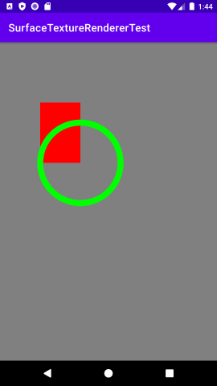
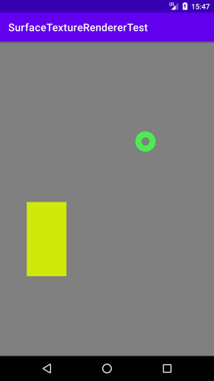
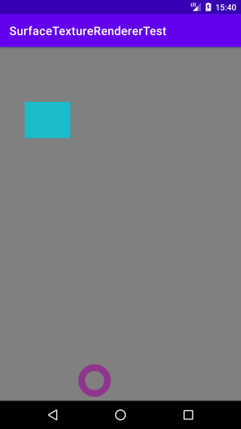

# SurfaceTextureRendererTest
SurfaceTexture に出力した画像を、画面に描画する方法  
https://www.hiramine.com/programming/android/surfacetexturerenderer_drawonce.html
https://www.hiramine.com/programming/android/surfacetexturerenderer_drawcontinuously.html
https://www.hiramine.com/programming/android/surfacetexturerenderer_usevbo.html

## Screenshots : スクリーンショット
  

## Requirements : 必要条件、依存関係
- Android Studio 4.2.2
- compileSdkVersion 30
- minSdkVersion 23
- minSdkVersion 30

## Author : 作者
Nobuki HIRAMINE : [http://www.hiramine.com](http://www.hiramine.com)

## License : ライセンス
```
Copyright 2017 Nobuki HIRAMINE

Licensed under the Apache License, Version 2.0 (the "License");
you may not use this file except in compliance with the License.
You may obtain a copy of the License at

    http://www.apache.org/licenses/LICENSE-2.0

Unless required by applicable law or agreed to in writing, software
distributed under the License is distributed on an "AS IS" BASIS,
WITHOUT WARRANTIES OR CONDITIONS OF ANY KIND, either express or implied.
See the License for the specific language governing permissions and
limitations under the License.
```
